# slidev-component-poll

[](https://www.npmjs.com/package/slidev-component-poll)

Poll and quiz component for `Slidev`.

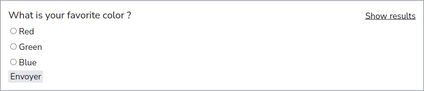

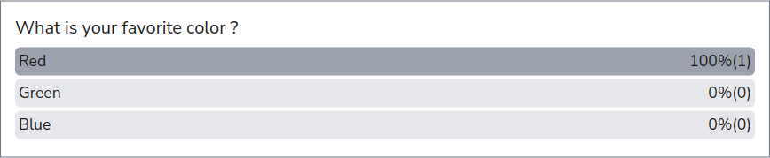

See below for more examples.

## Installation

```bash
npm i slidev-component-poll
```

## Slidev Configuration

Define this package into your slidev addons.

In your slides metadata (using Front Matter):
```
---
addons:
  - slidev-component-poll
---
```

Or in your `package.json`:
```json
{
  "slidev": {
    "addons": [
      "slidev-component-poll"
    ]
  }
}
```

### Using serverRef

`slidev-component-poll` can use built-in slidev capabilities to allow communication with multiple clients.

By using serverRef, the communication with multiple clients is **only possible in dev mode**!

This won't work if you build and deploy to a static host.

To use serverRef you will need to define the default value in your own project.

For that you need to create a `vite.config.ts` file with (see [here](https://sli.dev/custom/config-vite.html) for more information):
```js
import { defineConfig } from 'vite';

export default defineConfig({
  slidev: {
    serverRef: {
      state: {
        polls: {},
        users: {},
      }
    }
  }
});
```

### Using a server

You can use a Server Sent Events server or a WebSocket server to allow communication with multiple clients.

Take at look at this custom implementation: https://github.com/Smile-SA/slidev-poll-server

In that case you need to use the `pollSettings` config in your markdown file Front Matter to set the server URL (Update the value of `server` using your own URL).

For HTTP Server Sent Events server:
```yaml
---
pollSettings:
  server: http://localhost:8080
---
```

Or for WebSocket server:
```yaml
---
pollSettings:
  server: ws://localhost:8080
---
```

Then, in the presentation, click on the connect icon.

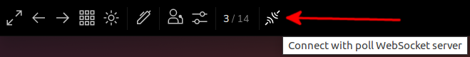

Type in a hash that you can share with other peoples and press <key>enter</key>. (you can use the proposed hash: everybody that are on the same presentation will have the same)

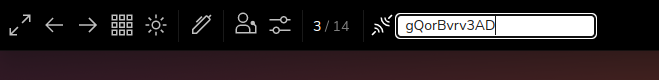

You are connected!

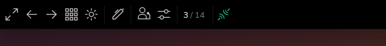

### Anonymous

If you prefer that users answer polls anonymously, or prefer to skip the step of defining a name when answering polls, add in the Front Matter:

```yaml
---
pollSettings:
  anonymous: true
---
```

## Components

You can create a poll by using the [`Poll` component](#poll).

But if this component does not suit your needs, you can use individual [sub-components](#sub-components).

### Poll

All in one component for poll:
```html
<Poll question="What is your favorite color ?" :answers="['Red', 'Green', 'Blue']" />
```

Or with markdown answers:
```html
<Poll question="What is your favorite color ?">

**Red**

**Green**

**Blue**

</Poll>
```

Parameters:

* `answers` (`string[]`): The available answers to the question (can also be provided using the default slot).
* `clearable` (`boolean`, default: `false`): Can the poll be cleared after being closed ? (results will be cleared and poll can be reopened again). For controlled polls only.
* `controlled` (`boolean`, default: `false`): If `true` the poll will not be opened at the start, use controls to open and close the poll ([see below for more information](#controlled-forms)).
* `correctAnswer` (`number | number[]`): Highlight the corresponding answer(s) in the results (index starts at `0`).
* `displayResults` (`'poll' | 'quiz' | 'publicQuiz'`, default `'quiz'`): Display results as poll or quiz ([see below for more information](#poll-and-quiz)).
* `editable` (`boolean`, default: `false`): Can someone's answer be edited by this same person ?
* `id` (`'string'`): Unique identifier for poll (if not provided, the system will generate an id based on the page number).
* `multiple` (`boolean`, default: `false`): Can someone select multiple answers (displays checkbox instead of radio buttons).
* `question` (`string`, **required**): The question displayed as title.
* `reOpenable` (`boolean`, default: `false`): Can the poll be reopened after being closed ? (old results are kept).
* `showResults` (`'free' | 'auto' | 'none'`, default `'auto'`):
  * `'free'`: User can see results before submitting
  * `'auto'`: Results are only shown after user submission
  * `'none'`: Results are only accessible for user that have access to controls

## Poll and quiz

You can use this addon to either create polls or quizzes mostly base on the `displayResults` props.

Here is an example when `displayResults="poll"` (left side show slideshow view and right side show presenter view).

* Poll not answered:
  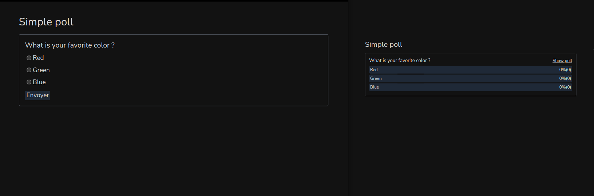
* Poll results (when answered):
  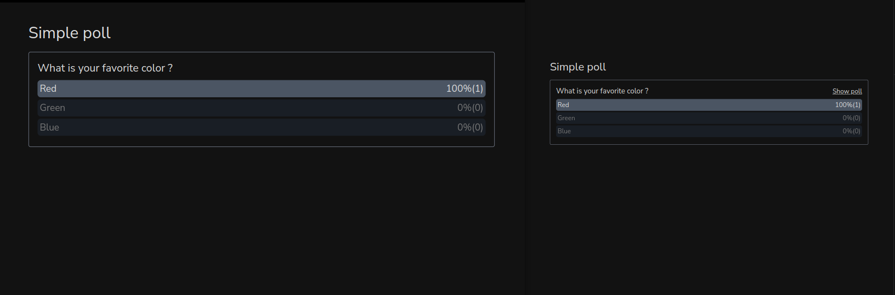

Code example:
```md
<Poll question="What is your favorite color ?" :answers="['Red', 'Green', 'Blue']" displayResults="poll" />
```

Here is an other example when `displayResults="quiz"` or `displayResults="publicQuiz"`.

* Quiz not answered:
  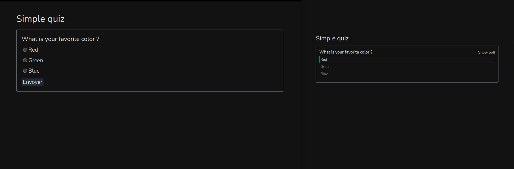
* Quiz results (when answered):
  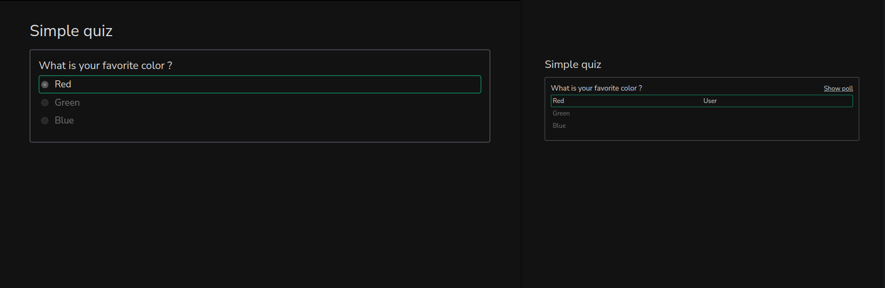

Code example:
```md
<Poll question="What is your favorite color ?" :answers="['Red', 'Green', 'Blue']" correctAnswer="0" />
```

People names will be shown in front of the results for the presenter or if `displayResults="publicQuiz"`.

## Controlled forms

When using `controlled=true` the poll can be controlled meaning that its state can be changed.

The poll can have three state:
* `CLEARED`: Starting state, no results recorded and no result can be recorded, waiting to be opened.
* `OPEN`: Poll is open, and results can be received.
* `CLOSED`: Poll is closed, and results can not be received anymore.

Here is an example when `controlled=true` and `clearable=true` (left side show slideshow view and right side show presenter view).

* Poll is not yet open:
  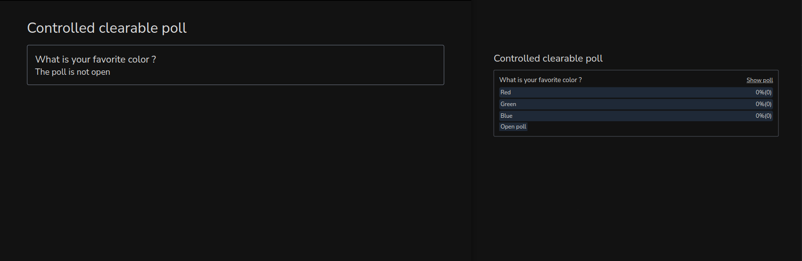
* Poll is open:
  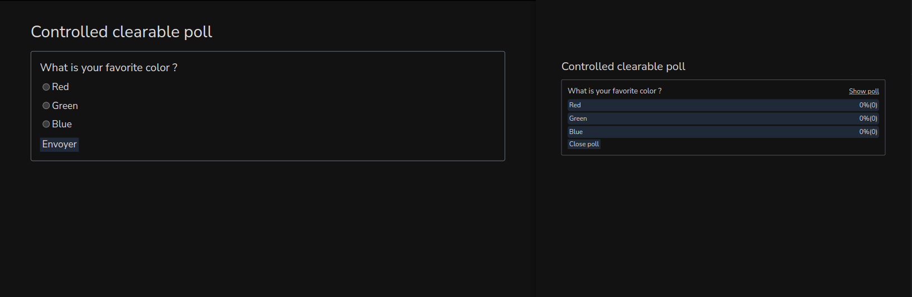
* Answer has been submitted:
  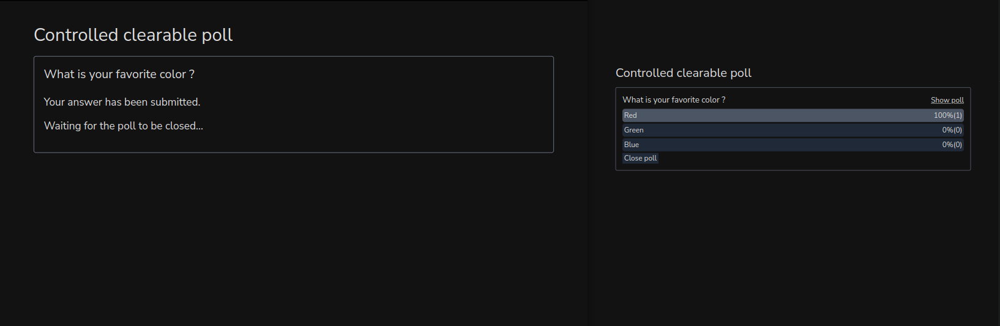
* Poll is closed:
  

If you run the slidev server with remote access (and you should if you don't use a server but want other people to answer your polls), then you can control the state of the poll from the presenter view.

When remote control is enabled, the presenter button is not shown, so people does not have direct access to the presenter view.

But anyone who tap the presenter view URL in its browser can access the presenter view, and then control the state of your poll.

If you want to prevent that, you can start the server with `--remote=[your_password]` and in that case the presenter view is a little more secured.

When using a password, the controls will also be displayed on the slideshow but only if the password query parameter in the URL is correct.

We can sum up the following cases:

* slideshow view without password (or wrong password): controls are not shown
* slideshow view with correct password (if any is set): controls are shown
* presenter view: controls are shown
